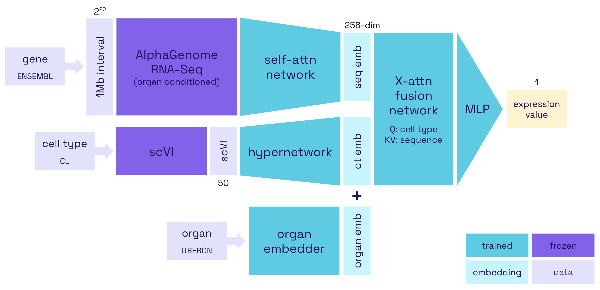

# scAlphaGenome

### Group Members: Jack Hwang, Irith Katiyar, Rohan Krishnamurthi, Liza Lopatina

## Model Architecture

scAlphaGenome is a two-channel encoder-decoder model comprised of a sequence encoder, a cell type encoder, and a multimodal decoder. Each encoder consists of a frozen model (AlphaGenome and scVI, respectively) and a learnable projection layer or network. The decoder is comprised of a cross-attention-based fusion network and a small MLP that yields a single expression value as output. Our model architecture is illustrated below:



## Setup

### 1. Installing dependencies

Project dependencies are managed with `uv`; to install them, run:
```bash
uv sync
```

This step should be run whenever changes are made to `pyproject.toml`.

### 2. AlphaGenome API and model (via Hugging Face) access

To access the [AlphaGenome API](https://github.com/google-deepmind/alphagenome), get an API key [here](https://deepmind.google.com/science/alphagenome/).

To access the [AlphaGenome model](https://github.com/google-deepmind/alphagenome_research) through Hugging Face, accept the conditions [here](https://huggingface.co/google/alphagenome-all-folds). Create a user access token [here](https://huggingface.co/settings/tokens) to authenticate this application to Hugging Face services.

### 3. Set up environment variables

Copy the template to your own `env` file (if not already done):
```bash
cp env-template env
```

Fill in any empty variables (e.g., personal API keys and tokens). Do not edit pre-filled variables. Then run:
```bash
source env
```

### 4. Authenticate with GCP

Log into GCP:

```bash
gcloud auth application-default login
gcloud config set project $GCP_PROJECT
```

If you want to check if you are already logged in, run:

```bash
gcloud auth list
```

Ensure that you have been granted the necessary IAM permissions to this GCP project.

### 5. Save AlphaGenome GTF annotation file locally

Run the code in `alphagenome_gtf.ipynb` if you haven't already. (This metadata step will save time when running `process_pseudobulk.py`.)


## Data Processing Pipeline 

The full data processing pipeline is: 

**[raw] single-cell &rarr; pseudobulk &rarr; model-ready [processed]**

Files may be stored locally (in respective `data/` subfolder) or on the Cloud (GCS bucket defined in `env`).

### 1. Download raw data 

Download `.h5ad` data files from [Tabula Sapiens v2](https://figshare.com/articles/dataset/Tabula_Sapiens_v2/27921984) and place them in `data/raw/`. The current organs we are working with are: lung, heart, kidney, liver; so you only need to download those files for now. 

These files may be quite large, so do NOT upload them to the bucket; only upload data files once they have gone through at least one round of preprocessing.

### 2. Run scRNA-seq -> pseudobulk data processing script

To run the preprocessing script:

```bash
uv run python3 src/process_raw_sc.py \
    --input <filename>.h5ad \
    --organ <organ_name> \
    --assay <10X|etc.> \
    --gcs
```

Example command:

```bash
uv run python3 src/process_raw_sc.py \
    --input Lung_TSP1_30_version2d_10X_smartseq_scvi_Nov122024.h5ad \
    --organ lung \
    --assay 10X \
    --gcs
```

### 3. Run pseudobulk -> AlphaGenome input data processing script

To run the processing script:

```bash
uv run python3 src/process_pseudobulk.py \
    --organ <organ_name> \
    --assay <10X|etc.>
```

Example command:

```bash
uv run python3 src/process_pseudobulk.py \
    --organ lung \
    --assay 10X
```

The output `.parquet` file is saved locally to `data/processed/`.

## Metadata Processing Pipeline

### 1. Run metadata processing script

To run the preprocessing script:

```bash
uv run python3 src/process_metadata.py \
    --organ <organ_name> \
    --assay <10X|etc.>
```

Example command:

```bash
uv run python3 src/process_metadata.py \
    --organ lung \
    --assay 10X
```

The output `.json` and `.txt` files are saved locally to `data/metadata/`.


## Modeling Pipeline 

### 1. Sequence encoding via AlphaGenome

Here is an example of how to run the frozen AlphaGenome encoder on the processed data:

```bash
uv run python3 src/alphagenome_encoder_model.py --organ lung --assay 10X --workers 8 --max_genes 50000
```

If you want to run the baseline version of our model, replace `alphagenome_encoder_model.py` with `alphagenome_encoder_base.py`.

Outputs are saved locally to `data\ag`.

Note: before running this, you must have `ALPHAGENOME_API_KEY` set in your `env` file.

### 2. Cell type encoding via scVI

Here is an example of how to extract and aggregate the cell-type scVI vectors from the raw Tabula Sapiens data:

```bash
uv run python3 src/cell_type_encoder.py --input Lung_TSP1_30_version2d_10X_smartseq_scvi_Nov122024.h5ad --organ lung --assay 10X
```

Outputs are saved locally to `data\scvi`.

### 3. Multimodal decoding and results analysis

Located in `decoder.ipynb`.


